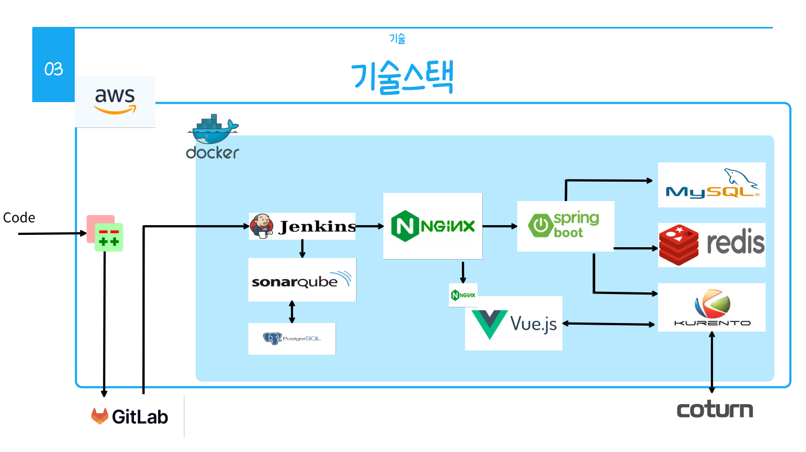
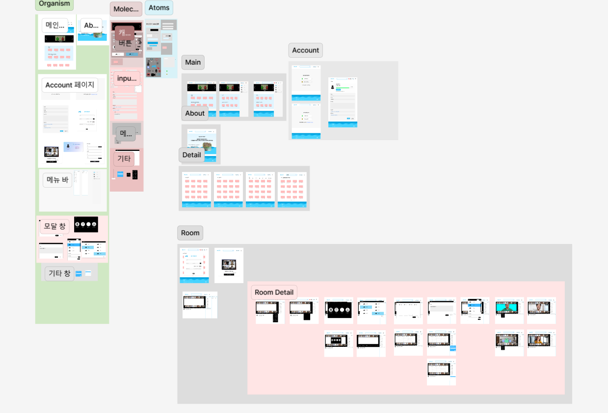
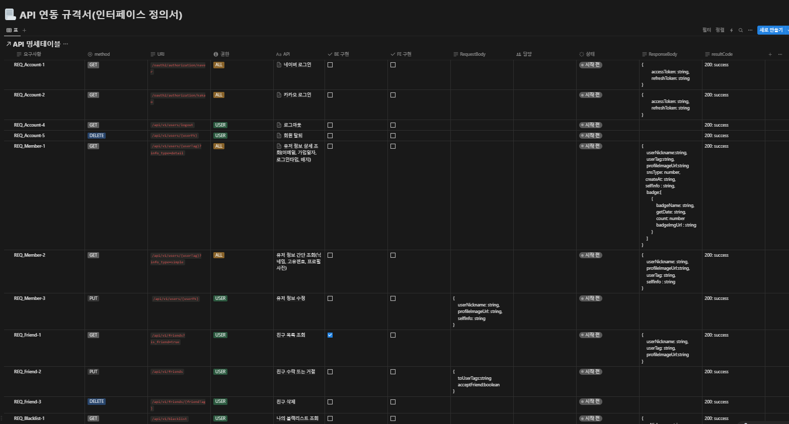
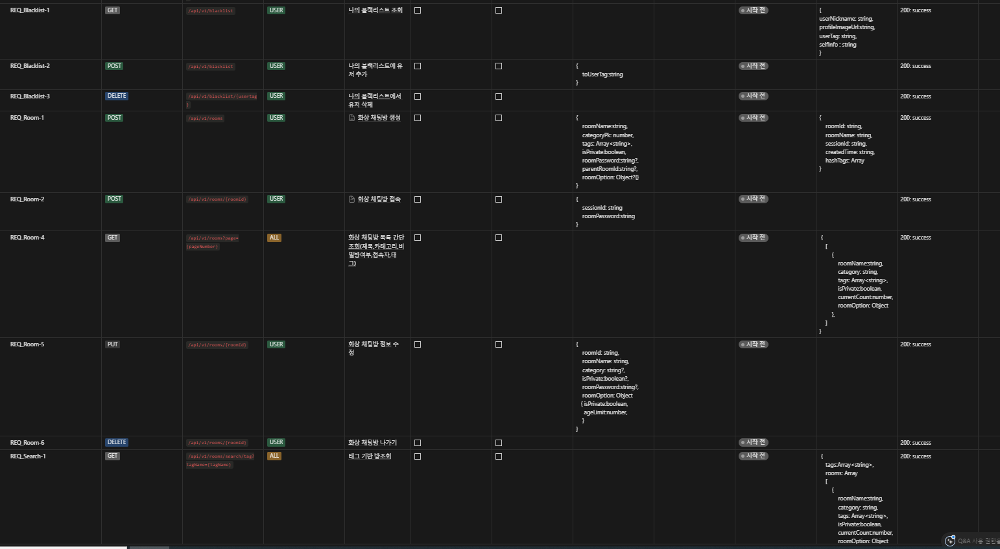
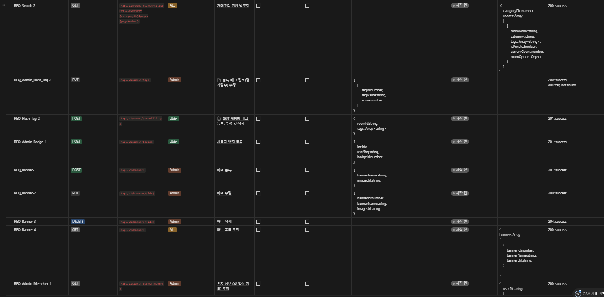
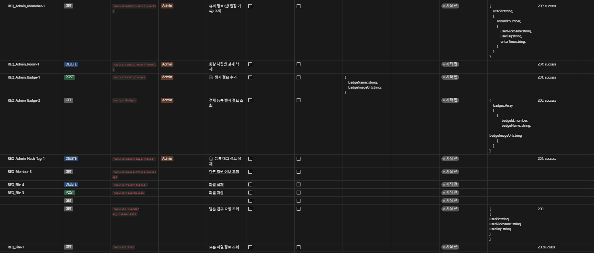
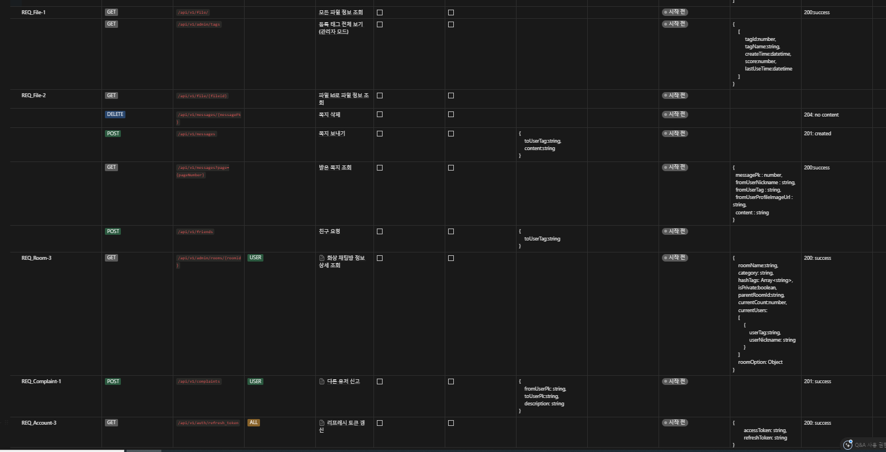
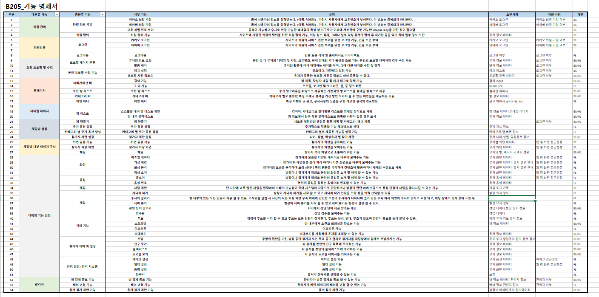
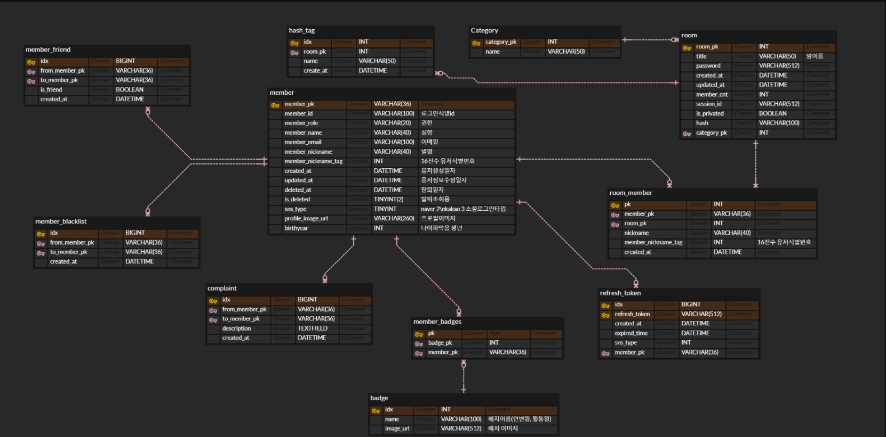

#Project-toki
스프링 부트를 이용하여 화상채팅 서비스를 구현

##SourceCode
https://i10b205.p.ssafy.io:8989/plugins/gitiles/S10P12B205

## 프로젝트 소개
음성채팅, 화상채팅이 가능한 커뮤니티입니다.

## 개발기간
* 24년 1월 8일 ~ 24년 2월 16일

### 멤버구성
 - 백현우 FE: WebRTC , WebSocket , Game
 - 정지훈 BE: INFRA , WebRTC , WebSocket , SNSLogin 
 - 김성민 BE: Message , Blacklist , Friend
 - 윤건웅 FE: MainPage , Login , addModal
 - 김수현 FE: Profile , RoomPage , Blacklist , Friend
 - 김근형 BE: Profile , User , Badge

### 개발 환경
 - 'Java 17'
 - **IDE** : STS 4.1
 - **Framework** : Springboot , 
 - **Framework** : Vue3 , vuetify , pinia
 - **Database** : mySql, redis , kurento , coturn
 - **ORM** : JPA
 - **INFRA** : Docker, EC2 , jenkins , nginx , sonaqube , gerrit
 - **MORE** : Kurento , Stomp 
### 아키텍처

## 📌 주요 기능
#### 로그인 - 
- 네이버, 카카오 API 이용
- 로그인 시 쿠키(Cookie) 및 세션(Session) 생성

#### 마이 페이지 
- 회원정보 변경
- 친구추가, 친구수락

#### 방 만들기
- 해시 태그 선택, 해시 태그 추가, 수정, 삭제
- 방 정보 수정
- 

#### 신고
- 다른 유저 신고

#### 방 조회
- 태그 기반 방 조회
- 카테고리 기반 방 조회

#### 화상 채팅 
- 배지 선택
- 주제 선택
- 카메라 연동
- 화면 확대
- 녹화
- 소회의실 만들기
- 간단한 게임(사다리, 주사위, 룰렛, 단어맞히기)

#### 배지
- 나에게 배지 추가
- 나에게 배지 삭제

#### 메인 페이지 
- 유저 정보 조회
- 다른 회원 정보 조회
- 블랙 리스트 관리

#### 블랙 리스트
- 나의 블랙리스트에 유저를 추가
- 나의 블랙리스트에 유저를 삭제

#### 관리자 페이지 
- 배지 추가
- 배지 삭제
- 화상 채팅방 강제 삭제
- 방 입장 기록 조회
- 등록된 해시태그 전체 확인
- 등록된 해시태그 수정

#### 와이어 프레임
 

#### API 명세서

#### 기능 명세서

#### ERD

